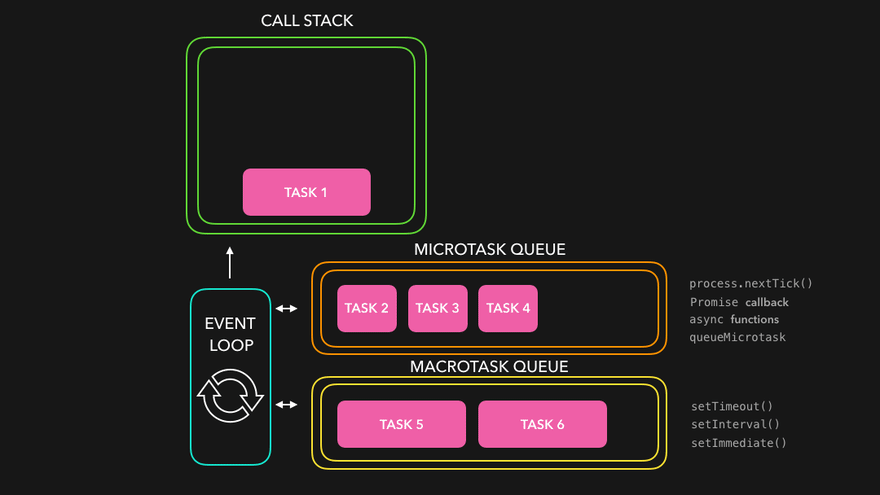

Hi there 👋, and welcome to my Github home! I’m Rahul, a Software Architect passionate about designing and building scalable, high-performance systems that drive innovation. With 8+ years of experience in software development, specialize in architecting cloud-native solutions using Google Cloud Platform (GCP) while ensuring modular, efficient, and maintainable code.

🏗️ Tech Expertise
I have deep expertise in software development, leveraging modern frontend frameworks (React, Angular) and robust backend architectures (Node.js, Python). My experience spans RESTful API design, microservices, and high-availability cloud deployments.

🌩️ Cloud & DevOps
Proficient in Google Cloud Platform (GCP) for designing scalable and distributed applications. I integrate CI/CD pipelines using Jenkins, Docker, and Kubernetes, Terraform, ensuring smooth and automated deployments.

📊 Tech Stack
✅ Frontend: React, Angular, TypeScript
✅ Backend: Node.js, Python
✅ Databases: SQL (PostgreSQL, MySQL), NoSQL (MongoDB, Firestore)
✅ Cloud & DevOps: GCP (Cloud Functions, Pub/Sub, BigQuery, GKE), Docker, Kubernetes, Jenkins
✅ Architecture: Microservices, Event-driven, Modular Design
✅ Data & ETL: BigQuery, Apache Beam, Dataflow

🎯 Key Strengths
🚀 Scalable Cloud-Native Architecture on GCP
🛠 Microservices & API Design
🔍 Data Engineering & ETL Workflows
🧠 Design Patterns, SOLID Principles
💡 Optimizing Performance & Reliability

I love solving complex engineering challenges and mentoring teams to build future-proof applications. Let’s connect and discuss how technology can drive innovation! 🤝

<ul>
    <li><b>LinkedIn</b> - <a href="https://bit.ly/3MucFKv" target="_blank">https://bit.ly/3MucFKv</a></li>
    <li><b>Medium</b> - <a href="https://bit.ly/3MtbeMv" target="_blank">https://bit.ly/3MtbeMv</a> </li>
    <li><b>Leetcode</b> - <a href="https://leetcode.com/rk-tech/" target="_blank">https://leetcode.com/rk-tech/</a></li>
</ul>

 

